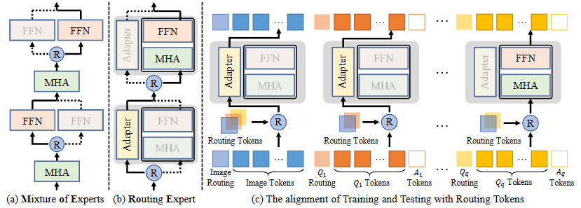

# Routing Expert (RoE)

[](LICENSE)
[]()
[]()

**Official PyTorch implementation of our ICLR 2025 paper:**  
> **Routing Experts: Learning to Route Dynamic Experts in Existing Multi-modal Large Language Models**
>
> Qiong Wu<sup>1,2</sup>, Zhaoxi Ke<sup>1,2</sup>, Yiyi Zhou<sup>1,2,*</sup>, Xiaoshuai Sun<sup>1,2</sup>, Rongrong Ji<sup>1,2</sup>
> 
> <sup>1</sup> Key Laboratory of Multimedia Trusted Perception and Efficient Computing, Ministry of Education of China, Xiamen University, 361005, P.R. China  
>
> <sup>2</sup> Institute of Artificial Intelligence, Xiamen University, 361005, P.R. China  
>
> *Corresponding Author.

**Abstract:** Recently, *mixture of experts* (MoE) has become a popular paradigm for achieving the trade-off between modal capacity and efficiency of *multimodal large language models* (MLLMs). Different from previous efforts, we are dedicated to exploring the dynamic experts in existing MLLMs and showing that a standard MLLM can also be a mixture of experts. However, achieving this target is still notoriously challenging. The well-trained MLLMs are more accustomed to the fixed pathway and a drastic change in its inference manner also greatly impedes its performance. To address these issues, we propose a novel dynamic expert routing method for existing MLLMs, termed ***Ro**uting **E**xperts* (**RoE**), which can achieve example-dependent optimal path routing without obvious structure tweaks. Meanwhile, a new structure sparsity regularization is also introduced to force the well-trained MLLMs to learn more short-cut pathways. In addition, we also address the alignment of the training and inference of MLLMs in terms of network routing. To validate RoE, we apply it to a set of existing MLLMs, including LLaVA-1.5, LLaVA-HR and VILA, and conduct extensive experiments on a bunch of VL benchmarks. The experiment results not only show the effectiveness of our RoE in improving MLLMs' efficiency, but also yield obvious advantages over MoE-LLaVA in both performance and speed, *e.g.*, an average performance gain of 3.3% on 5 benchmarks while being 1.61 times faster.

<div  align="center">    

</div>

*In Proceedings of the International Conference on Learning Representations (ICLR) 2025*


## 📌 Overview
This repository contains:
- ✅ Implementation of Routing Expert
- ✅ Training/evaluation scripts

## 🚀 Getting Started

### Installation for Train
```bash
git clone https://github.com/DoubtedSteam/RoE.git
cd RoE/RoE
conda create -n RoE_train python=3.10
conda activate RoE_train
pip install -r requirements.txt
```
### Preparation of Data

Please download the annotation of the final mixture our instruction tuning data from [LLaVA](https://github.com/haotian-liu/LLaVA) [llava_v1_5_mix665k.json](https://huggingface.co/datasets/liuhaotian/LLaVA-Instruct-150K/blob/main/llava_v1_5_mix665k.json), and download the images from constituting datasets:

- COCO: [train2017](http://images.cocodataset.org/zips/train2017.zip)
- GQA: [images](https://downloads.cs.stanford.edu/nlp/data/gqa/images.zip)
- OCR-VQA: [download script](https://drive.google.com/drive/folders/1_GYPY5UkUy7HIcR0zq3ZCFgeZN7BAfm_?usp=sharing), **we save all files as `.jpg`**
- TextVQA: [train_val_images](https://dl.fbaipublicfiles.com/textvqa/images/train_val_images.zip)
- VisualGenome: [part1](https://cs.stanford.edu/people/rak248/VG_100K_2/images.zip), [part2](https://cs.stanford.edu/people/rak248/VG_100K_2/images2.zip)

After downloading all of them, organize the data in your path,

```
├── coco
│   └── train2017
├── gqa
│   └── images
├── ocr_vqa
│   └── images
├── textvqa
│   └── train_images
└── vg
    ├── VG_100K
    └── VG_100K_2
```

And drop half SFT data by:

```bash
python random_drop.py
```

### Start Train

Training script with DeepSpeed ZeRO-3: 

```bash
bash RoE/scripts/v1_5/finetune_RoE.sh
```

### Installation for Eval
```bash
cd RoE/lmms-eval
conda create -n RoE_eval python=3.10
conda activate RoE_eval
pip install -e .
```

### Eval

Evaluate with [lmms-eval](https://github.com/EvolvingLMMs-Lab/lmms-eval):

```bash
bash eval_roe.sh
```

## Acknowledgments

This project was made possible thanks to the following open-source projects/resources:

- **[LLaVA](https://github.com/haotian-liu/LLaVA)**  
  Our work builds upon LLaVA as the foundation for training pipeline development

- **[lmms-eval](https://github.com/EvolvingLMMs-Lab/lmms-eval)**  
  Our work applies lmms-eval's robust testing framework for model evaluation.


